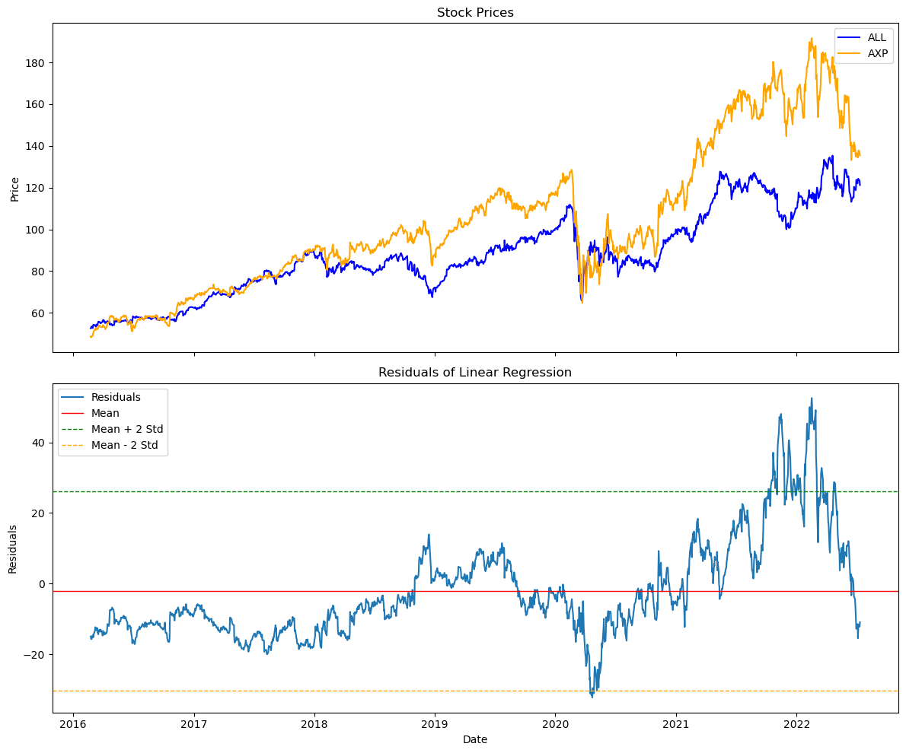
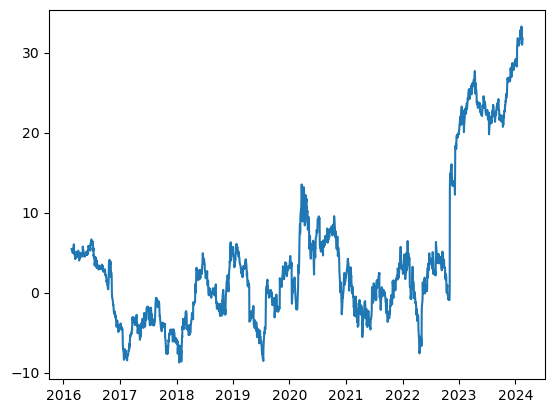
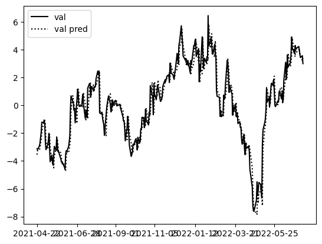

## Pair stock analysis

A stationary process is a characteristic of a time series in which the mean and variance do not change. \
To determine whether a time series is mean-reverting or not, we examine whether it is a stationary process or not. \
we perform a cointegration test on the pair of stocks. If mean reversionality appears in the difference between two correlated stocks, we can trade when the residual is far from its mean.

## RNN
Then, we used LSTM to predict pair_values

